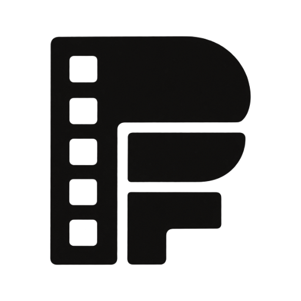

<p align="center"></p>

# 🎬 PowaFlex

> **Alpha 0.9.11** · Dashboard de gestión de cine para tu servidor Plex: estadísticas, completismo
> de filmografías, calendario de estrenos venideros conectado a TMDB y envío directo a Radarr.

PowaFlex es tu centro de mando cinéfilo. Vive junto a tu servidor Plex (en Docker), lee tu
biblioteca de películas **directamente por la API** (sin exports ni CSV), la cruza con
**TMDB** y con **Radarr**, y convierte todo eso en dos cosas: *conocer a fondo el cine que
tienes* y *cazar el cine que te falta o que está por venir*. Todo se guarda en local, sin
cuentas ni telemetría.

---

## ✨ Qué hace

| Sección | Qué encuentras |
|---|---|
| 📊 **Dashboard** | Totales (películas, horas, disco, vistas) y gráficas por década, género, país y resolución, más el ritmo de crecimiento de la biblioteca y tus tops. |
| 🎞️ **Biblioteca** | Toda la colección en parrilla de pósters con código de color (🟢 en Plex · ★ vista) y filtros estilo Letterboxd: género, país, década, visto/sin ver, largo/corto (<40 min), resolución, HDR/Dolby Vision, notas mínimas de IMDb/RT/Letterboxd… y ordenaciones por cualquiera de esas notas (incluido aleatorio). La nota que sale en cada póster es configurable (IMDb, Letterboxd o la combinada de MDBList). |
| 🎭 **Directores/as y actores/actrices** | Ranking por presencia, con filtros por género, vivo/fallecido, continente y país. Cada ficha cruza la filmografía de TMDB con lo que tienes: % de completismo (solo largometrajes, con filtros para cortos, documentales, TV y dirección coral), lo que falta (botón **+ Radarr**) y proyectos anunciados. Quien dirige **y** actúa tiene dos barras (director/a y actor/actriz). |
| 🗓️ **Cine venidero** | Calendario mensual de estrenos y proyectos anunciados de tus directores/as y actores/actrices top y favoritos, con envío a Radarr en un clic. |
| 🎪 **Festivales** | Las secciones oficiales de los grandes festivales —los seis de la vía Óscar internacional (Cannes, Venecia, Berlinale, Sundance, Toronto, Busan) más **San Sebastián y sus Horizontes Latinos**—, edición a edición, con el **palmarés histórico** de cada premio, los grandes premios anuales con **palmarés y nominadas por año** (Goya, César, BAFTA, Cine Europeo, **Óscar a la mejor película** y Óscar internacional) y el canon **Sight & Sound 2022** completo. Cualquier emparejado con TMDB se puede **corregir a mano** desde la propia tarjeta. Manda a Radarr lo que falte, sigue a sus directores/as (de una en una o la sección entera) y deja que el pase nocturno **vigile las ediciones nuevas** y te avise en el Dashboard. |
| ⭐ **Favoritos** | Ranking paginado por nº de títulos (con filtro de fallecidos y actualización de estado vital), paquetes temáticos de directores/as (españoles, premiados en festivales, emergentes, taquilleros, en boga) con **«añadir todos»**, pegar una lista de nombres separados por comas o líneas, y añadir a cualquiera tecleando. Cada persona puede seguirse como director/a, como actor/actriz **o por las dos facetas a la vez**, y la lista se **exporta a .txt** para llevarla a otra instalación. Alimentan el calendario y el auto-Radarr. |
| 🧭 **Descubrir huecos** | Lo que te falta de tus favoritos y de tus filmografías top, más los canon de directores/as de **They Shoot Pictures** (Top 250 de siempre y Top 100 del siglo XXI) para detectar ausencias en tu servidor. Con buscador de personas y actualización bajo demanda. |
| 🏆 **Listas y retos** | Listas de MDBList y **retos de Letterboxd** con anillos concéntricos de «lo que tengo» vs «lo que he visto», ocultar los que no te interesen y envío en bloque a Radarr. |
| 📚 **Sagas** | Detecta franquicias desde la colección real de TMDB de cada película: qué partes te faltan o están por estrenar, con envío a Radarr. |
| 👁️ **Visionado** | Contador de lo que llevas visto (Plex + Letterboxd, con lo que aún no cuadra con tu biblioteca), visto vs. pendiente por década y género, directores/as con obra pendiente, joyas y discrepancias frente a tu nota de Letterboxd, mejor valoradas sin ver y los «must-see» de Metacritic pendientes. |
| 💾 **Calidad y disco** | Resoluciones, códecs, HDR, candidatas a upgrade (buenas películas por debajo de 1080p) con comprobación en **JustWatch** de si existe versión de más calidad, duplicados, archivos más pesados y la **deuda de Radarr**: qué pediste que sigue sin aparecer (con su fase de estreno: en cines, ya en digital, sin fecha) y qué llegó por debajo del corte de tu perfil, con re-búsqueda en un clic. |
| 🩺 **Salud de los datos** | Auditorías locales: películas sin ficha TMDB, identidades repetidas, Letterboxd sin casar, peticiones zombis y emparejados de personas sin demostrar — cada hallazgo con su remedio. |
| 🟠 **Letterboxd** | Importa el **.zip completo** del export (diario, notas, vistas, watchlist y listas) o el **feed RSS** de tu usuario, y lo cruza con Plex. |

Además: **buscador global** (Ctrl/⌘ + K), ficha de película en cualquier póster de la app, notas de
IMDb, Rotten Tomatoes, Metacritic y Letterboxd (vía MDBList) enlazadas a cada web, cifrado opcional
de credenciales (`POWAFLEX_SECRET`) y **auto-Radarr diario** de los estrenos de tus directores
favoritos vivos.

La sincronización con Plex es **incremental** y se repite sola cada noche (03:00), con histórico
persistente de cada pasada, tope de tiempo por paso y aviso en la barra lateral si algo falló. Los
datos de TMDB se cachean para no abusar de su API, y las filmografías solo se re-piden cuando el
propio feed de cambios de TMDB dice que cambiaron.

## 📋 Requisitos

- Un servidor **Plex** accesible en tu red (y su [X-Plex-Token](#credenciales)).
- Una **API key de TMDB** (gratuita).
- **Radarr** (opcional, solo para añadir películas desde la app).
- **Docker** en cualquier máquina de tu red: el propio servidor de Plex, un NAS…

## 🚀 Instalación

### Docker Compose (genérico)

```yaml
services:
  powaflex:
    image: ghcr.io/foreverramone/powaflex:latest
    container_name: powaflex
    restart: unless-stopped
    ports:
      - '3860:3860'
    volumes:
      - ./data:/data
    environment:
      - TZ=Europe/Madrid
```

```bash
docker compose up -d
```

Abre `http://IP-DEL-HOST:3860` → **Ajustes** → sigue los 4 pasos guiados. Listo.

### Guías paso a paso por plataforma

- 📗 **[Synology DSM (Container Manager)](docs/synology.md)**
- 📙 **[UNRAID](docs/unraid.md)**

### Actualizar a una nueva versión

Las versiones se publican en [Releases](https://github.com/ForeverRamone/PowaFlex/releases) y
la imagen Docker se reconstruye automáticamente. Actualizar es:

```bash
docker compose pull && docker compose up -d
```

(En Synology y UNRAID hay botón para esto — está explicado en cada guía.) Tus datos viven en la
carpeta `data/` y sobreviven a cualquier actualización.

## 🔑 Credenciales

Las mismas guías están dentro de la app (Ajustes → desplegables bajo cada campo).

<a name="credenciales"></a>

**X-Plex-Token**
1. Abre `app.plex.tv`, entra en tu servidor.
2. En cualquier película: **⋯ → Obtener información → Ver XML**.
3. En la URL de la pestaña nueva, copia el valor de `X-Plex-Token=...`.
4. URL del servidor: IP local + puerto 32400, p. ej. `http://192.168.1.50:32400`.

**API key de TMDB** (gratis)
1. Cuenta en [themoviedb.org](https://www.themoviedb.org) → **Ajustes → API → Crear (Developer)**.
2. Vale la **API Key (v3)** o el **Read Access Token (v4)**.

**Radarr**
- URL: la misma con la que abres Radarr (puerto 7878 por defecto).
- API key: **Settings → General → Security → API Key**.
- Tras «Probar y cargar perfiles», elige perfil de calidad y carpeta raíz.

**MDBList** (opcional, recomendado)
- Cuenta en [mdblist.com](https://mdblist.com) → **Preferences → API Access**.
- Añade a toda la app las notas de IMDb, Rotten Tomatoes (crítica y público), Metacritic,
  Letterboxd y Trakt (filtros, ordenaciones, joyas/discrepancias) y las listas como retos.
- PowaFlex respeta el límite diario de tu cuenta (gratuita o Supporter, configurable en Ajustes)
  repartiendo la sincronización de notas en varios días si hace falta.

## 🧑‍💻 Desarrollo local

```bash
git clone https://github.com/ForeverRamone/PowaFlex.git
cd PowaFlex
npm install
npm run dev        # API en :3860 + frontend Vite en :5173
```

Stack: Node 24 · Fastify · better-sqlite3 · React 19 · Vite · Tailwind 4 · Recharts.
Los datos van a `server/data/` (configurable con `DATA_DIR`).

## 🔒 Privacidad y seguridad

- Todo corre y se guarda en tu máquina (SQLite en `/data`). Sin cuentas, sin telemetría.
- De tu red solo salen las consultas a los servicios que conectes: TMDB, MDBList, JustWatch,
  Letterboxd y Wikipedia (festivales).
- Autenticación básica opcional con `POWAFLEX_AUTH="usuario:contraseña"`. Aun así está pensada
  para red local: no la expongas a internet sin un proxy con autenticación delante.
- En **Ajustes → Copia de seguridad** puedes descargar la base de datos entera y
  exportar/importar la configuración para reinstalar sin empezar de cero.

## 🙏 Créditos

- Datos de cine por cortesía de [TMDB](https://www.themoviedb.org). Este producto usa la API de
  TMDB pero no está avalado ni certificado por TMDB.
- Gracias a los proyectos [Plex](https://plex.tv), [Radarr](https://radarr.video) y
  [Letterboxd](https://letterboxd.com) por sus APIs y formatos abiertos.

Licencia [MIT](LICENSE).
